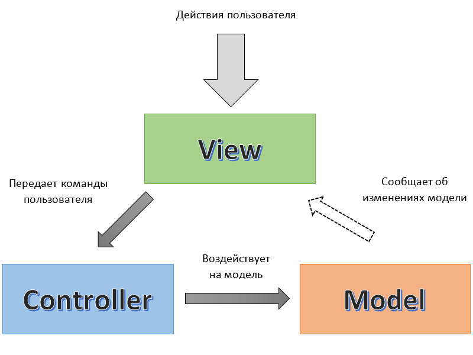

### MVC

#### Термины

`Model` - компонент который отвечает за данные и бизнес-логику в приложении.
`View` - компонент который отвечает за интерфейс взаимодействия с системой. Это не только UI интерфейс, также это могут быть данные которые специально готовятся в API ответах.
`Controller` - компонент системы который управляет взаимодействием между View и Model.

**Связь View ↔ Controller**

- View зависит от Controller.
- View использует контроллер, чтобы изменять Model.
- View может забирать данные из Controller, который в свою очередь берет данные из Model.

**Связь View ↔ Model**

- View зависит от Model (сильная связь), она подписывается на события изменения Model и берет из нее данные.
  Также может брать данные через Controller.

**Связь Controller ↔ Model**

- Controller зависит от Model (сильная связь).
- Controller использует Model, чтобы изменять данные в ней и опционально может получать данные из Model, чтобы перенаправить их в View.

### 📌 Основной смысл MVC

- Model не знает о View напрямую.
- Все изменения модели происходят через Controller, можно делать агрегации данных из разных точек доступа модели.
- View управляет UI-логикой, Controller служит медиатором между View и Model.
- Улучшенная поддержка тестирования: Model и Controller можно тестировать отдельно от View.
- View можно легко заменить: она изолирована от Model и не содержит бизнес-логики.

### Отличия от MVP и MVVM

#### Отличия от MVP

- View содержит UI-логику.
- View зависит от Model.
- View может забирать "сырые" бизнес-данные из Controller или напрямую из Model и работать с ними (преобразование, подготовка, обработка событий и т.д.).

#### Отличия от MVVM

- View содержит UI-логику.
- View зависит от Model.
- View может забирать "сырые" бизнес-данные из Controller или напрямую из Model и работать с ними (преобразование, подготовка, обработка событий и т.д.).
