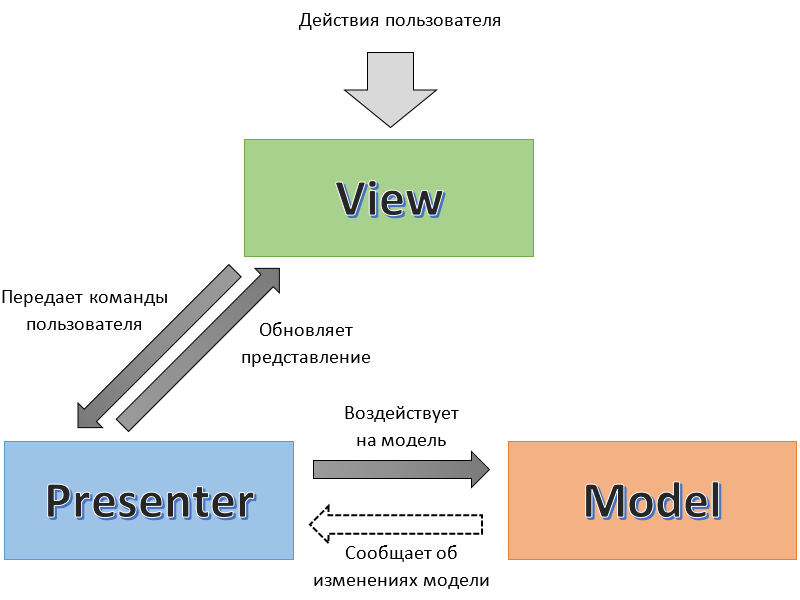

### MVP

#### Термины

MVP - это архитектурный паттерн, который предлагает разделение логики UI интерфейса на 3 составные части

`Model` - компонент системы который отвечает за данные и бизнес-логику с этими данными.

`View` - компонент системы который отвечает за отображение интерфейса.

`Presenter` - компонент системы который является представителем данных модели к View, реализует UI логику и подготавливает данные для отображения из Model во View.

**Связь View ↔ Presenter**

- View зависит от Presenter (сильная связь).
- View использует Presenter, чтобы изменять Model.
- View забирает данные из Presenter, которые он для нее готовит.
- View отправляет все UI-события (клики и прочие взаимодействия) в Presenter.
- View не имеет UI-логики, вся логика находится в Presenter.
- Presenter зависит от View (сильная связь), она ему необходима для обновления View.

**Связь View ↔ Model**

- View не зависит от Model и ничего о ней не знает.
- Model не зависит от View и ничего о ней не знает.

**Связь Presenter ↔ Model**

- Presenter зависит от Model (сильная связь).
- Presenter подписывается на события Model, чтобы получать обновленные данные.
- Presenter не имеет бизнес-логики, вся логика находится в Model.
- Presenter может напрямую менять Model.

### 📌 Основной смысл MVP

- Все изменения `Model` происходят через `Presenter`.
- `Presenter` управляет UI-логикой, также служит медиатором между `View` и `Model`.
- Улучшенная поддержка тестирования: `Model` и `Presenter` можно тестировать отдельно от `View`.
- `View` можно легко заменить: она изолирована от `Model` и не содержит бизнес-логики.
- `Presenter` можно легко заменить: он изолирован от конкретной реализации `View`, взаимодействует с ней через интерфейс (контракт).
- Нет зависимости `View` от `Model`: `View` не знает ничего о модели, она работает только с презентером.
- `Presenter` управляет всей реакцией на пользовательские действия, обновляя `Model` и/или вызывая обновления `View`.

### Отличия от MVC и MVVM

#### Отличия от MVC

- `View` не содержит UI-логику — вся UI-логика находится в `Presenter`.
- `View` не зависит от `Model`.
- `Presenter` активно управляет `View`, в то время как `Controller` в MVC скорее служит плоским медиатором без UI-логики для взаимодействия с `Model`.

#### Отличия от MVVM

- Отсутствует двухсторонний биндинг данных.
- `Presenter` знает о `View` и напрямую вызывает её методы (например, `render()`).
- В MVVM `ViewModel` не знает о `View` и использует реактивность или биндинг для передачи изменений, а в MVP `Presenter` явно обновляет `View`.
